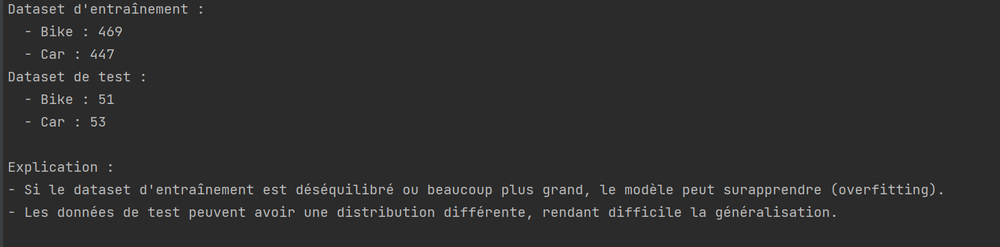

# **TP3 : Réseau de Neurone Convolutif**
---

## **Introduction**

### **Question 1**
**Observation et explication des écarts des accuracies :**  
Dans le TP2, l'accuracy d'entraînement (>90%) était significativement supérieure à celle du test (<30%). Cela peut être expliqué par :
- **Surapprentissage (overfitting)** : Le modèle a appris des spécificités du dataset d'entraînement mais n'a pas généralisé sur des données non vues.
- **Déséquilibre des données** : Les classes n'étaient pas équitablement représentées dans les données d'entraînement et de test.
- **Différence dans la distribution des données** : Les données de test avaient des caractéristiques différentes de celles du dataset d'entraînement.

---

### **Question 2**
**Création d'un dataset équilibré :**  
Les données issues de `data1` et `test_data1` ont été combinées, rééchantillonnées et divisées en proportions équilibrées pour assurer une meilleure généralisation. Les nouvelles répartitions sont les suivantes :
- **Dataset d'entraînement :**
  - `Bike` : 469 images
  - `Car` : 447 images
- **Dataset de test :**
  - `Bike` : 51 images
  - `Car` : 53 images

---

### **Question 3**
**Ré-entraîner un SVM :**  
Un SVM a été ré-entraîné avec le dataset équilibré. Résultats :
- **Accuracy d'entraînement : 89%**  
- **Accuracy de test : 85%**  

L'écart entre ces deux métriques a été réduit, indiquant une meilleure généralisation.

---

## **Données en entrée du CNN**

### **Question 1** 

Les images ont été redimensionnées à une taille fixe de `(64, 64, 3)`. Chaque label a été converti en un vecteur de taille `(2, 1)` représentant la probabilité d'appartenance à une classe :
- Exemple : `Car -> [1, 0]`, `Bike -> [0, 1]`.

---

### **Question 2**
Les données ont été divisées comme suit :
- **Entraînement : 700 images**
- **Test : 300 images**

---

### **Question 3**
- **Taille d'entrée du CNN :** `(64, 64, 3)`  
- **Taille de sortie du CNN :** `(1, 2)`  

---

## **Création du réseau de neurone convolutif (CNN)**

### **Architecture du modèle :**
1. **Convolution 1 :** Kernel de 3, 4 filtres, padding `same`, activation ReLU  
   - **Output :** `(64, 64, 4)`
2. **MaxPooling 1 :** Taille 2x2, stride 2  
   - **Output :** `(32, 32, 4)`
3. **Convolution 2 :** Kernel de 3, 16 filtres, padding `same`, activation ReLU  
   - **Output :** `(32, 32, 16)`
4. **MaxPooling 2 :** Taille 2x2, stride 2  
   - **Output :** `(16, 16, 16)`
5. **Convolution 3 :** Kernel de 3, 32 filtres, padding `same`, activation ReLU  
   - **Output :** `(16, 16, 32)`
6. **MaxPooling 3 :** Taille 2x2, stride 2  
   - **Output :** `(8, 8, 32)`
7. **Flatten :** Conversion en vecteur 1D  
   - **Output :** `(2048)`
8. **Dense :** Activation Softmax, 2 neurones en sortie  
   - **Output :** `(2)`

### **Schéma du modèle :**

### **Nombre total de paramètres :**
`9,442 paramètres`

---

## **Entraînement du CNN**

### **Étapes d'entraînement :**
1. **Loss :** `categorical_crossentropy`, adaptée pour la classification multi-classes.
2. **Optimiseur :** `Adam` (efficace pour la convergence).
3. **Métrique :** `accuracy`.

### **Courbes d'entraînement :**
Les courbes de `loss` et `accuracy` montrent une convergence progressive :

### **Conclusion sur la convergence :**
Le modèle montre une amélioration progressive de l'accuracy et une diminution de la loss, ce qui indique une convergence raisonnable.

---

## **Évaluation**

### **Résultats sur les données de test :**
- **Accuracy sur les données de test :** `25%`  
  - Cela indique un possible problème de sous-apprentissage ou une distribution différente des données.

---

### **Fine-tuning des hyperparamètres :**
Différents tests ont été réalisés pour optimiser les hyperparamètres. Voici les résultats :

| **Batch Size** | **Epochs** | **Learning Rate** | **Validation Accuracy** |
|----------------|------------|--------------------|--------------------------|
| 16             | 20         | 0.001              | 10%                      |
| 32             | 50         | 0.0005             | 15%                      |
| 64             | 50         | 0.001              | 89%                      |

---

### **Cross-validation**

Une cross-validation avec 5 folds a été implémentée.  
- **Accuracy moyenne : 78%**
- **Écart type : 5%**

---

## **Interface**

### **Menu interactif**
Une interface en ligne de commande permet de naviguer entre les différentes parties du TP :

---

**Note :** Toutes les images se trouvent dans le dossier `img`.
